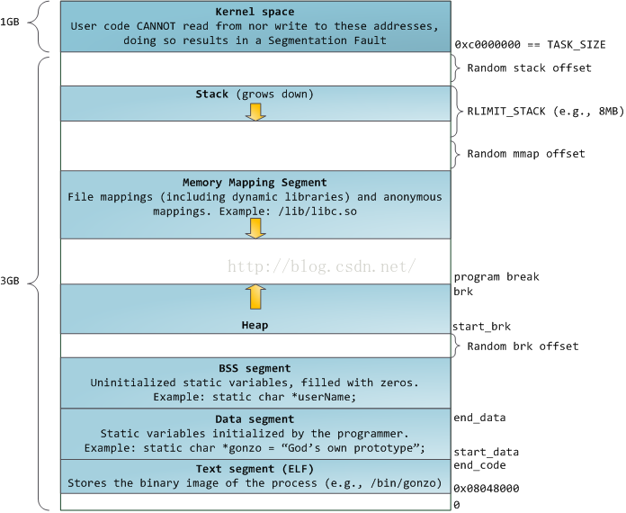

## 第一部分：Linux操作系统综述
#### ls -l
> 权限位：第一组代表所有者权限；第二组代表所属用户组权限；第三组代表其他组权限。  
> 硬链接数目：待补充

#### chown & chgrp
> 前者改变文件所属用户；后者改变所属用户组。

#### 软件管理
>（1）linux软件分为两大体系：CentOS和Ubuntu，前者用rpm，后者用deb，例如：rpm -i jdk-xxxx-linux-x64_bin.rpm和dpkg -i jdk-xxxx-linux-x64_bin.deb（-i表示install的意思）  
>（2）查看已安装软件列表：rpm -qa和dpkg -l.  
>（3）删除已安装程序：rpm -e和dpkg -r.  
>（4）软件管理命令：yum和apt-get，卸载可以用yum erase java-11-openjdk.x86_64和apt-get purge openjdk-9-jdk.  
>（5）应用服务器地址：sources.list  

#### nohup
> nohup command > outfile 2>&1 & （2>&1 是将标准出错重定向到标准输出，这里的标准输出已经重定向到了out.file文件，即将标准出错也输出到out.file文件中）  

#### systemctl
> 设置开机启动 systemctl enable xxx

#### kill
> ps -ef | grep "xxxx" | awk '{print $2}' | xargs kill -9

#### fork
> linux通过fork来创建新的进程，当parent进程fork子进程时，会将parnet进程的所有数据结构也都copy给子进程。

#### 内存
> 1.对于内存而言，放进程运行中产生数据的这部分，叫代码段（Data Segment）。其中局部变量也是朝生夕死（运行时变量），而长时间保存的对象，或说是需要指明才销毁的，这部分称为堆（Heap）。  
>2.brk分配内存：当需要分配内存的数据量需要较小时，使用brk分配，回和原来堆的数据连在一起；  
>3.mmap分配内存：当需要分配内存的数据量较大时，使用mmap分配，会划分出一整块新的区域使用。  

#### 文件系统
> 一切皆为文件

#### 异常处理机制
> linux提供异常信号机制来处理异常情况，例如Ctrl+C代表中断信号，用户进程通过kill函数来终止进程。

#### 进程间通信
> 消息队列机制：msgget、msgsnd、msgrcv等命令  
> 共享内存机制：shmget创建一块共享内存、然后通过shmat将共享内存映射到自己的内存上，后续就可进行读写了。（共享读写就会存在一个征用的问题，这时就是用信号量Semphore来处理，sem_wait来竞争或等待，sem_post来释放信号量，以便其他人再次访问）

#### 机器之间的通信
> 遵循TCP/IP协议，基于Socket实现网络通信。

#### Glibc
> Glibc 为程序员提供丰富的 API，除了例如字符串处理、数学运算等用户态服务之外，最重要的是封装了操作系统提供的系统服务，即系统调用的封装。

#### CPU简述
> 1. CPU，中央处理器，所有的设备都要围绕他运行，而连接CPU和其他设备的，是靠一种叫"总线(Bus)"的东西。另一个重要的设备是“内存(Memory)”，作为计算过程中的临时存储单元。  
> 2. CPU分为3个模块：计算单元（处理加法、位移等运算）、数据单元（CPU寄存器，离CPU最近的存储单位，避免CPU每次运算要经过总线到内存中拿）、控制单元（CPU的指挥中心）。
> 3. CPU工作过程：控制单元中的指令指针寄存器中，存放了下一条指令在内存中的地址。控制单元会不断的将代码段指令取出，然后放入到指令寄存器中。指令分为2部分，一是做什么类型的操作，例如是加法还是位移；二是操作哪部分数据。所以控制中心在执行一条指令时，会把第一部分交给运算单元，将第二部分交给数据单元。计算单元处理完成后，将计算结果暂存到数据单元中，最终还是会回到内存的数据段中。  
> 
> 4. 进程切换：待补充

#### Bus简述
> 1. 总线分为两类数据：地址总线和数据总线。前者记录了在内存中数据所在的位置，后者则是用来记录真正数据的。
> 2. 关于总线的位数：地址总线的位数决定了访问范围有多广，例如只有2位，就意味着CPU只能认00，01，10和11这4个位置；而数据总线的位数，决定了CPU每次请求内存数据的多少，以2位为例，代表CPU一次只能通过总线从内存中取出2位数据，想要拿一个8位数据，要分4次取才行。

#### x86架构
> 源于8086处理器，开始开源，并形成业界标准。
> 

#### 8086处理器
> 1. 数据单元：为了暂存数据，8086处理器有8个16位的通用寄存器：AX、BX、CX、DX、SP、BP、SI、DI，其中AX-DX又分成了两个8位寄存器，AH，AL....DH、DL，其中H达标High位，L代表Low位，其目的是可以支持更加灵活的存储，长短均能存。
> 2. 控制单元：IP寄存器（指令寄存器）；CS寄存器（代码段寄存器）通过CS可以找到代码在内存中的存储位置；DS（数据寄存器）通过DS可以找到数据在内存的存储位置。SS寄存器（栈寄存器）执行函数用的，入栈出栈。
> 3. 计算单元
> 4. x86架构图
> 

#### 32位处理器
> * 在32位处理器中，有32根地址总线，可以访问2^32=4G内存。  
> * 为了和8086兼容，32位处理器分为”实模式“和”保护模式“。当系统刚刚启动时，CPU处于实模式，当需要更多内存时，CPU就会切换到保护模式。  

#### 实模式
> * 在计算机上面，实模式存在的时间非常之短，所以一般我们是感觉不到它的存在的。
> * 处理器8086有20根地址线（32位处理器，则有32根），因此不能访问20位以上的地址线，也就是只能访问1M内存。 
> * CPU复位（reset）或加电（power on）的时候就是以实模式启动。

## 第二部分：系统初始化
#### 启动Linux
> 1. 主板通电，CPU初始采用实模式工作，读取主板上的ROM，ROM已经刻录好了BIOS。
> 2. 在x86架构中，会将1M内存空间的0xF0000到0xFFFFF这64K空间映射给ROM使用，也就是说，访问到这部分内存地址时，会映射放到到BIOS。
> 
> 3. 启动初期，CPU需要执行BIOS中的代码段，因此默认会将指令寄存器设置为0x0000，代码段寄存器置为0xFFFF，然后通过JMP指令跳到ROM中执行代码，指针跳到内存中的0xFFFF0位置（从上面2得知，正好处于ROM区范围，也印证了即将要执行的是BIOS代码），于是BIOS就开始了初始化的工作。
> 4. 启动第二步，就是BIOS要检查一下系统硬件是否正常（扩展：回想起以前用的主板故障诊断卡，其原理也是检测也是依赖于BIOS，而诊断卡实际只负责拿到结果译码显示而已）
> 5. 建立中断向量表和中断程序：加载完这些，就意味着用户的鼠标键盘操作，就可以打断CPU了，来优先接收用户行为了。
> 6. 内存映射显存：在显示设备上输出内容。
> 7. BIOS启动完成后，开始着手准备启动OS，在找到OS前要先找到OS所在的磁盘扇区，也就常言说的启动盘。启动盘一般会位于磁盘第一个扇区，占用512字节，并以0xAA55结尾。这是一个约定俗成的规定，满足这个条件时，BIOS就会认为这是一个启动盘。（Linux中使用grub2命令来创建启动盘）
> 8. 加载boot.img，由于boot.img只有512字节，其作用仅仅是起一个引导的作用，启用core.img（core.img又细分为diskboot.img、lzma_decompress.img、kernel.img、modules&others若干文件）。
> 9. 大部分情况我们都是从硬盘启动，因此启动控制权由boot.img转交给disboot.img，而diskboot.img的首要任务就是将core.img中其他的模块先加载进来。此时随着东西加载越来越多，实模式的1M空间已经无法存下，于是系统需要调用real_to_prot切换到保护模式，以此来寻求更大的寻址空间。
> 10. 切换到保护模式的主要工作都是围绕内存相关，首先是启动分段和分页（分段和分页详细描述，后面在linux内存篇在详细学习）。
> 11. 打开Gate A20：之前实模式下，仅用了20根地址总线，打开GateA20后，即可用32根地址总线，因此内存寻址空间也随之可达4G。
> 12. 解压并kernel.img（这里的kernel不是linux内核，而是grub2的），并执行grub_main()函数。
> 13. 中间grub_show_menu()函数会引导用户选择进入哪个OS，最终用户一旦确定选择，则会调用grub_menu_execute_entry()，函数内会调用grub_command_execute()来启动OS内核。
> 
> 总结：系统的一个启动过程大致就是BIOS→引导扇区Boot.img→diskboot.img→lzma_decompress.img（实模式切换到保护模式）→kernel.img（选择一个操作系统）→启动内核

#### Linux内核初始化
> 1. 内核启动入口：init/main.c文件中的start_kernel()开始
> 2. 创建0号进程：Kernel创建的第一个进程，也是唯一一个没有通过fork或kernel_thread创建的进程，当系统初始化完成后，init_task会退化成cpu_idle进程。
> 3. 1号进程（用户进程）
> 4. 建立访问权限机制：ring0-内核态；ring3-用户态。
> 5. 
> 6. 初始化进程：
> 7. 初始化内存管理   
> 8. 等后续再看，再补充吧，实在费劲了  
参考资料：https://blog.csdn.net/notbaron/article/details/80033417

## 第三部分：进程管理
#### 从文本编译到可执行的二进制程序
> 1. 我们写的代码都是文本格式，只有转存为二进制格式才能执行，从文本代码到二进制程序就是编译的过程；在linux下，二进制程序的格式为ELF（Executable and Linkable Format），ELF又分为三种类型。
> 2. 我们在linux上使用vim编写的代码.c文件，使用gcc编译后，生成.o文件，这个.o文件就是ELF文件的第一种类型，”可重定位“文件（relocatable file）。
> 
> 补充：这个.o文件只是大概描述了代码运行逻辑，运行所需的内存空间。其与之关联，需要调用的函数库还没有完全包含进来，因此需要想办法进行连接，连接又分为"静态连接"和"动态连接"。 
> 3. 创建静态连接资源库使用"ar"命令，将多个.o文件打包成一个.a文件，然后再次使用资源库时，使用gcc编译时配置静态连接，即可将资源库中的代码打包到可执行文件中，一旦连接成功，会将他们代码和变量的section合并到一起，形成最终可执行程序，这属于ELF文件的第二种类型。但有2个明显缺点：1.多个可执行文件都包含了"资源库1"，此时只是通过静态打包，会导致形成多个副本存在；第二个问题是，如果"资源库1"一旦更新，调用的程序却依旧引用了过时的资源库，如需更新，只能重新编译。
> 4. 基于上面静态连接的两个缺点，于是又了动态连接库，也就是ELF文件的第三种类型。
> 5. 执行程序
> 6. 从ps -ef看进程树   
>  (a) 所有用户态进程的祖先都是pid=1的线程；内核态进程的祖先都是pid=2的线程，从上面系统初始化章学习，1和2号进程都是由0号进程创建，在系统初始化完成后，0号进程已经变成了cpu_idle进程。  
>  (b) 在cmd列中，带中括号的代表是内核进程，不带中括号的是用户态进程。  
>  (3) tty列中带”?“的表示是后台启动的进程；

#### 线程
> 1. 有了进程为什么还要有线程：相比线程而言，创建一个进程消耗的系统资源更大一些，进程内部不仅包含了主线程，而且还需要维护内存、文件系统等等。
> 2. 线程中的数据：(1) 局部变量；（2）共享进程全局内存；（3）线程私有数据pthreadspecial

#### 进程数据结构
> 1. id字段有3个pid（process_id）、tgid（thread_group_id），group_leader。每个进程都有自己的pid，而每个线程都有自己的线程id（pthread_t类型)，内核通过tgid可以区分出线程属于哪一个线程组。当进程开始运行时，会创建一个线程组，线程组里只有一个主线程，主线程的tgid就等于pid，当其他创建其他线程时，就继承了主线程的tgid，这样内核就知道子线程属于哪个线程组了；group_leader就是指向主线程。  
> 2. 待补充  
> 

#### 进程状态
> 1. task_running并不一定是标识进程正在运行，而是表示线程已经准备就绪，等待cpu时间片可运行。
> 2. task_interruptible：表示可中断的睡眠状态
> 3. task_uninterrubtible：睡眠不可打断，不接受任何信号量，只能重启OS打断。
> 4. task_killable：与task_interruptible类似，不过只能响应致命信号，例如kill。

#### linux为什么要区分内核态和用户态
> os为了保证应用程序之间互不影响，因此通过进程方式将其互相隔离。为了os进程能对上层进程进行调度，因此内核态进程需要更高的访问控制权限，内核态进程可以对内存甚至硬件直接进行操作。如果不做访问权限区分，用户态进程假如错误的操作了其他进程内存，可能会导致其他进程crash掉。

#### 阻塞&非阻塞、同步&异步
> 异步同步反映的是执行者执行方式，同步表示执行者主动查询，异步表示自己不主动查询而是等待消息等机制通知。    
> 阻塞非阻塞反映的是执行者执行状态，阻塞表示执行者等待，非阻塞表示执行者不等做其他事情。

## 第四部分：内存管理
#### 
> 1. 处理器运算器和应用程序设计人员看到的只是虚拟内存空间和虚拟地址，而处理器片外的地址总线看到的只是物理地址空间和物理地址。从处理器运算装置和程序设计人员的角度来看，它面对的是一个用MMU、映射记录表和物理内存封装起来的一个虚拟内存空间。
> 2. linux中每个进程都拥有自己独立的虚拟内存映射表；且在同一时刻，cpu只能使用其中一个进程的映射表，这样就保证了各个程序的虚存空间时互不相扰、各自独立的。
> 3. linux的换入换出都是以大小相等的页为单位的，页大小一般为4K。通过页表（page table）的基地址和偏移量，能够定位到物理内存的具体位置。
> 4. Linux系统采用了虚拟内存管理机制，就是交换和请求分页存储管理技术。这样，当进程运行时，不必把整个进程的映像都放在内存中，只需在内存保留当前用到的那一部分页面。当进程访问到某些尚未在内存的页面时，就由核心把这些页面装入内存(换入换出)
> 5. linux中，32位操作系统内存，用户空间占用3g，内核空间占用1g；64位操作系统中，实际只用了46位，用户态和内核态各128T。
> 6. linux内存分页的原因是什么？待补充
> 7. 在实模式下，16位的cpu，怎么解决的寻找20位地址？待补充
> 8. 实模式和保护模式，在寻址时的方式都是差不多相同的，都是基于段基址+偏移地址来确定物理地址的；不同的是在定位段基址时方式不同。实模式下直接将段基址保存在寄存器上（在Intel实模式下，由于没有分段和分页机制，因此逻辑地址等于物理地址），而保护模式是存在一张表中，GDT（Global Discriptor Table）。
> 9. 无论是用户态还是内核态，操作访问的都是虚拟地址。
> 10. 从用户程序角度看，每个进程都仿佛是在独享着整个内存空间。但实际可能使用只是物理内存的一部分地址+换出到外存的虚拟空间。对于每个进程而言，所使用的用户态内存都是相互隔离的，但对于内核态的内存，所有进程都是公用的，因此在访问操作时需要加锁。
> 11. 64位操作系统，实际内存使用为什么是48位？待补充
> 12. 虚拟地址如何映射到物理地址？待补充
> 13. 关于linux的分段和分页？
> 分段机制对于虚拟内存到物理内存的映射依然是以进程位单位的，也就是说当物理内存不足时，换出到磁盘的依旧是真个进程，因此会导致大量的磁盘IO，从而影响系统性能。站在进程角度看，内存不足需要换出时，其实只有一部分数据是在使用的，将整个进程数据换出，略显粗鲁。因此人们更希望是将不常用或非正在使用的内存换出到磁盘，这样就能减少了磁盘的IO，也进一步提高了内存的效率，基于整个思想就引出后来发明的分页机制。
> 14. 32位操作系统中，假设物理内存4G，运行了30个进程，每个进程可用的虚拟内存空间是4G，因为要物理内存肯定是存不下的，因此就需要通过分页换入换出到外存，换入换出时，往往都是按页操纵，linux中每个页大小是4K，4G空间就需要1M个页，每个页用4字节存储（这4字节实际是一个索引，分高10位，中10位，低12位来映射到物理内存地址），如果这30个进程每个都需要自己的映射表，光存储映射表就要120M空间，对内核而言，有些浪费了，因此虚拟地址和页之间又增加了一级索引，即页目录.....（未完成）
> 15. 在linux内存管理模块中，经常提到的MMU（Memory Management Unit）实际存在于CPU中，它负责将内存的虚拟地址转化成物理地址。MMU中还有一个组件称为（Translation Lookaside Buffer TLB）页表缓存，保存最近使用过的页表映射，避免每次虚拟地址转换物理地址都要查询内存中的页表。
> 16. 逻辑地址与虚拟地址：在linux内核，虚拟地址是3G－4G这段地址，它与物理地址通过页表来映射，逻辑地址是指3G－3G＋main_memory_size这段虚拟地址，它与物理地址的映射是线性的，当然也可以通过页表映射。所以逻辑地址是虚拟地址的一部分。
> 17. 分段与分页：都是硬件的机制，操作系统作为软件要用硬件机制。分段容易碎片，不容易换出。
> 18. 在linux中如果用户malloc 一个非常大块的内存，标准c库会通过mmap来创建这块内存区间而不使用Heap内存, 这里的大块是指超过MMAP_THRESHOLD( 128k)， MMAP_THRESHOLD可以通过mallopt()函数动态调整。从下图中可以看到，mmap映射区向下扩展，堆向上扩展，两者相对扩展，直到耗尽虚拟地址空间中的剩余区域。
> 19. 因为虚拟内存用户空间结构都很类似，这导致很容易远程利用安全漏洞攻击,这种攻击往往需要知道进程的一个地址。为了避免hack侵入，linux会随机stack、mmap、heap在虚拟空间中的地址，一般通过在这些段空间起始地址加一个随机的offset，如下图的random-offset：
> 
> 20. TLB是CPU内的一块高速缓存，用于缓存页表查询结果，从而减少内存访问次数。页表的查询需要由硬件（CPU的MMU）来完成，但页表的维护需要软件来支持。
> 21. 32位系统内核空间内存布局：  
>  vector（4K）：也称作“中断向量表”？如果CPU支持向量重定位，那么CPU向量将会映射到这个区域。（控制寄存器 V 位）  
>  fixmap（3072KB）：内核(虚拟)空间地址固定的映射到物理内存。  
>  vmalloc（230MB）：非连续内存区域，vmalloc()函数用来分配物理上不连续但线性地址空间连续的高端物理内存。  
>  lowmem（760MB）：现行映射区，物理内存线性地址映射到这段内核空间的区域中。在ARM32平台上，物理地址[0:760MB]的这一部分内存被线性的映射到[3GB:3GB+760MB]的虚拟地址上。  
>  pkmap（2MB）：  
>  modules（4MB）：  

实模式下16位cpu：2^16=64K
实模式下20根总线：2^20=1M
32位操作系统：2^32=4G
48位：2^48=256T

## 第五部分：网络系统
#### 1.

