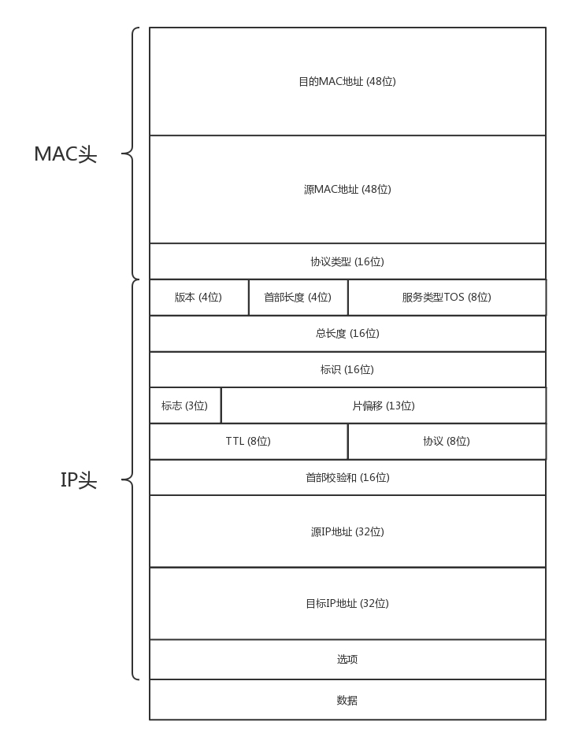
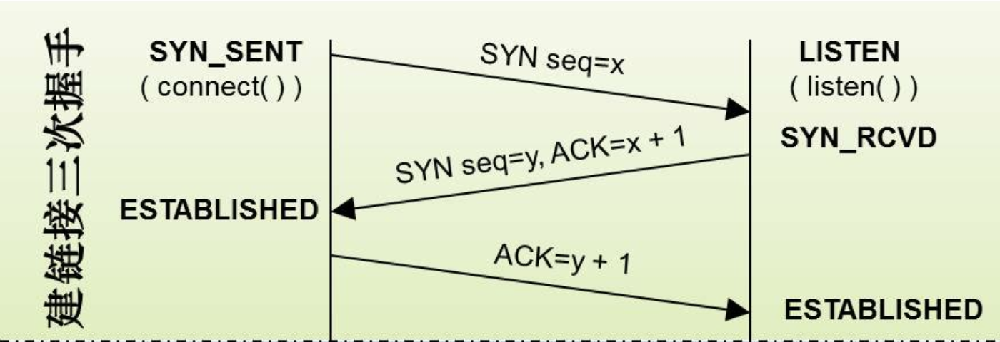
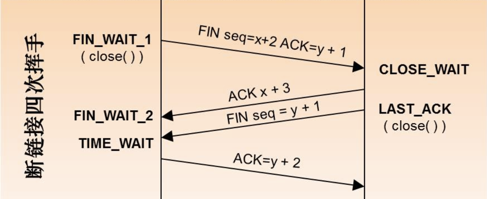
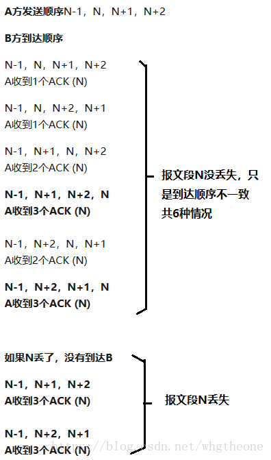
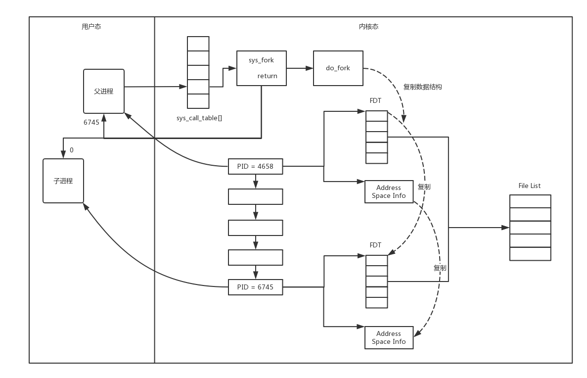
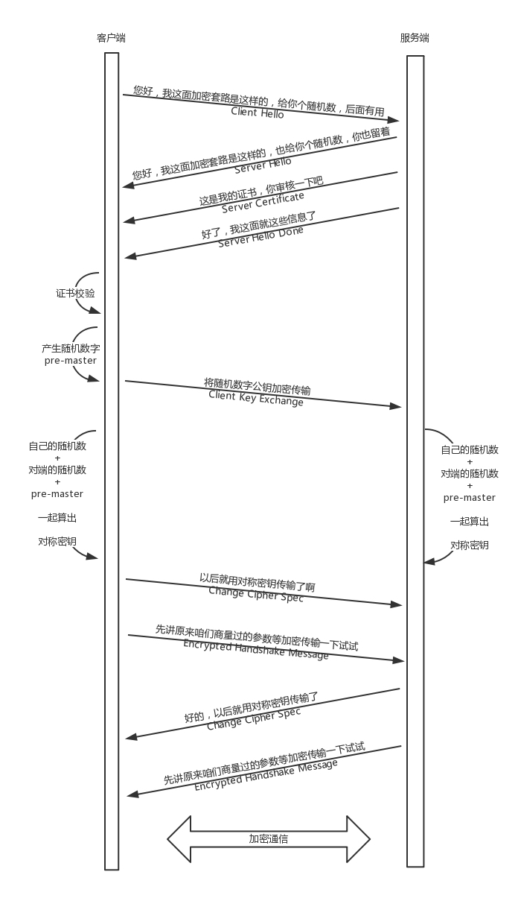

## 第2章：网络分层的真实含义是什么

<b> 1.网络分层的意义和我们传统软件开发的MVC目的是一样的，分层即为了解耦。</b>  
<b> 2.只要是跑在网络上的包，都是完整的。可以有下层没上层，但绝对不可能有上层没下层。</b>  
<b> 3.一包网络包从A到到B，简单说就是经历自上而下的层层装包，然后又经历了自下至上的层层拆包</b>  
<b> 4.有了IP地址为什么还要有MAC地址？</b>  
>（1）IP地址是OSI三层的地址；MAC地址是OSI二层地址。  
>（2）基于第1点，在广域网中寻址使用IP地址；在局域网中寻址使用MAC地址。  
>（3）IP地址具有定位功能；而MAC地址具有标识功能。

## 第3章：ifconfig：最熟悉又陌生的命令行

<b> 1.在Linux中，除了ifconfig以外，还可以使用另一个命令“ip addr”来查看我们的网卡信息。</b>  
<b> 2.关于IP地址</b>  
>（1）我们目前使用的IPv4地址占32位，也就是4字节；目前没有推广开的IPv6地址占128位，16字节。  
>（2）一个IP地址的组成包含“类型”、“网络号”和“主机号”三部分。  
>（3）网络号：我们的IPv4地址被划分为5大类，分别用“0”、“10”、“110”、“1110”和“11110”来区分标识。  
>    
>（4）根据IP所属的类型不同，所能表达的"网络号"和“主机号”数量也是有所不同。  
>   
> &nbsp;&nbsp;&nbsp;&nbsp;补充说明：上图中只是列举了ABC三类地址，未列出的D类（224.0.0.1-239.255.255.254）地址是广播地址；而E类是保留地址。  
>（5）IPv4地址面临的问题：C类地址包含的主机数太少；而A类B类地址包含的主机数又太多，造成地址浪费。  
>（6）基于第5点提出的问题，后续有了无类型域间选路（CIDR）解决方案：通过配置子网掩码将IP地址一分为二，通过将子网掩码和IP进行“&”运算，就可以求出IP的网络号。  
>（7）基于CIDR，为了区分出广域网和局域网，又将每一类IP地址分出了私有和公有范围：
>      
> 补充说明：CIDR不是为了区分私有网络和公有网络，而是用来判断来访IP和当前LAN是否同一网段。  
>（8）网络层到链路层之间为什么要进行分包处理：IP层之所以分包，是因为链路层MTU限制导致，而在网络传输过程中，各个链路层的MTU值也会发生变化。 

<b> 3.关于MAC地址</b>
> （1）MAC作为物理网卡地址，采用16进制标识，占用6字节。  
> （2）MAC地址理论上全球唯一，但实际上只能做到也必须是局域网唯一。  
<b> 4.关于网卡处理网络包的策略</b>  
> （1）默认采用fifo策略，先进先出。
> （2）fifo_fast更加复杂一些，采用3个band：band0优先级最好，band2优先级最低。如果band0有数据包，则优先处理，band1和band2稍后。
> （3）网络传过来的数据包，会进入哪个band，由IP头中的TOS字段（服务类型）记录。

## 第4章：DHCP与PXE

#### 1.IP默认的寻址逻辑
> （1）首先判断目标IP和本机IP是否同一网段  
> （2）同一个网段时，发送ARP请求，将MAC地址补充完整，然后将网络包交给交换机转发到目的地。  
> （3）如不在同一网段，则是将网络包发送至网关，由网关决定网络包的路由路径。  

#### 2.关于DHCP协议 
> 一种自动为终端分配IP的协议，即动态配置主机协议（Dynamic Host Configuration Protocal）

#### 3.DHCP工作方式
> （1）新机器加入网络时，由于没有被分配IP，只有自身MAC地址，因此会进行“DHCP Discover”，使用UDP协议，IP地址为“0.0.0.0”来发一条“Boot Request”广播（广播地址为255.255.255.255），试图获取在LAN内IP。  
> （2）当DHCP Server收到广播后，会随即对其进行回复：也是使用UDP协议，发送一条广播，将分配好的IP告知新机器，这个步骤称之为“DHCP Offer”。  
> &nbsp;&nbsp;补充说明：虽然DHCP Server得知了新机器的MAC地址，但仍采用广播方式，我猜是因为使用UDP协议时一定要基于IP，无法直接使用MAC地址。  
> （3）新机器收到DHCP Server的答复后，会在发送一条广播，告知自己准备使用Server分配的IP地址。意图也在告知其他消息后置的Server撤销IP分配，以便提供给下一个IP租用者。  
> &nbsp;&nbsp;补充说明：此时，由于新机器还没有得到DHCP Server的最终回复，IP地址仍采用”0.0.0.0“。  
> （4）最终DHCP收到新机器的确认后，广播发送“DHCP ACK”回执，并将这组IP和MAC加入到路由配置表中，后续通讯即可通过IP发送。
  
#### 4.关于PXE批量安装操作系统：文章只提供思路，日后需要时再实践即可。

## 第5章：从物理层到链路层
#### 1.物理层
>（1）位居OSI模型中第一层，其作用是为网络设备之间提供联通、互联、传输。该层关心的是信号与介质，例如双绞线，同轴电缆、光纤等。二进制数据只有通过网卡先转换成正负极、强弱电、光波的闪灭来表示并传输。  
>（2）物理层设备：网线、中继器（放大信号，延长传输距离）和集线器（可以连接多台设备）  

#### 2.链路层
>（1）链路层也叫MAC层，即媒体访问控制，通过名称可大致了解OSI定义这层的目的，该层关心的是数据发送逻辑，包括检测报文完整性（CRC，通过XOR异或算法，来计算整个包是否在发送过程中出现问题）。  
>（2）链路层设备：网桥（早期2层设备，相当于一个2口的交换机），交换机。  
>（3）链路层协议：IEEE、FDDI、ATM，PPTP、MPLS、ARP协议（前3个属于1层2层协议，PPTP和MPLS都是实现VPN技术不同的协议，PPTP只在2层工作，而MPLS则在和ARP一样，属于2层3层协议）  
> &nbsp;&nbsp;待考证：在实际网络架构中，链路层采用的协议不同，也需要物理层传输介质改变，因此例如我们常见的IEEE、FDDI、ATM等协议都是跨物理层和链路层，而我们最常见的网卡设备，也是同时工作在一层和二层的设备。

#### 3.集线器(Hub)与交换机(Switch)对比
>（1）Hub属于1层设备；Switch属于2层设备。  
>（2）Hub采用广播方式传输数据；Switch通过自我学习方式，构建转发表。  
>（3）Switch支持生成树算法，可以构建出物理有环路，而逻辑无环的网络。  

#### 4.嗅探器 & ARP欺骗
>（1）将网卡开启promiscuous模式（混杂模式）后，可以监听到当前网段内的所有数据包，但前提是采用Hub相连，如果使用Switch组建的局域网，则只能监听到自己的包。  
>（2）利用ARP欺骗嗅探：攻击者A可以伪装发送一个ARP请求告诉受害者B，自己是网关，同时开启IP转发。此时A就成为中间人拦截了B所有要出网关的包，并通过IP转发功能将请求转发给网关，当网关响应时也先经过A再到B，而A就成功窃听到了B所有的请求。

#### 5.MTU是1518的原因
> 这个值是考虑到传输效率和时间的一个折中方案，太小效率低，因为每次发送头尾就要18字节；而设置太大，因为以太网信号检测缘故，会导致阻塞等待时间过长

## 第6章：交换机与VLAN
#### 1.如何解决网络中的环路问题
>（1）使用最小生成树的方式，解决网络拓扑图中的环路问题。  

#### 2.关于网络拓扑图中最小生成树的问题（STP）
>（1）回顾STP算法思想：STP算法的目的是用最小代价求出最短联通路径，当联通路径求出时，也顺带解决了环路问题。  
>（2）根据IEEEE802.1D定义，每个网桥必须在每1-10秒内交换BPDU包，从而判断端口使用情况，来消除环路。  
>（3）生成树的算法和网桥设备没有任何关系，只要设备能提供生成树的算法，就可以消除环路问题。  

#### 3.如何解决广播和安全问题
> 一种解决方案就是划分出子网，将多个网络进行隔离，其中可以进行物理隔离和虚拟隔离。  
> &nbsp;（1）物理隔离：虽然实现隔离，但扩展性、灵活性较差，每次改动需要依赖硬件支持。  
> &nbsp;（2）虚拟隔离(VLAN)：虚拟局域网，工作在第二层的协议，其原理是在Mac包头上加一个Tag，附上VLAN ID，这个ID占用12位，可表示4096个网络。当交换机再转发数据包时，会先取下Mac头上的VLAN ID，判断只有相同的VLAN ID才会进行转发给自己域内的主机。而交换机之间通过Trunk口相连，这种口可以转发属于任何VLAN的数据包。  

## 第7章：ICMP与Ping命令
#### 1.关于ICMP协议
> （1）ICMP全称是Internet Control Message Protocol，即互联网控制报文协议。属于OSI模型上的第三层协议，使用UDP协议传输数据包。  
> （2）查询报文：例如基于ICMP协议封装的ping命令，以及ping命令里使用的TTL字段，也均所属ICMP协议。  
> （3）差错报文分类  
>> ① 主机不可达：回应客户端目标主机不可达的原因（例如主机不可达、端口不可达、协议不可达等等）；  
>> ② 源站抑制：通俗而言网络拥堵，生产大于消费，目标主机待处理请求过多，希望发送方减缓速度。  
>> ③ 时间超时：TTL消耗完毕，但仍未到达主机。  
>> ④ 路由重定向：发现到达目标主机比当前更短的路径。  

#### 2.Ping命令工作详解
> （1）构建Ping该命令：  
>> ① 封装ICMP数据包：例如本例中是请求数据包，因此ICMP的类型字段设置为8。  
>> ② 顺序号：每发一个ping命令，都会将顺序号加1。（我们一般使用ping命令时，都会发送一批数据包，来判定网络情况，例如：不带参数的ping则会发送3次报文；而ping -t则会无休止的发送数据包）  
>> ③ 时间戳：为了计算RTT（往返时间）会在报文数据部分插入时间戳。  

>（2）发送命令：将上面封装好的报文和IP地址，一并由ICMP协议提交给IP层发送。  
>（3）到达目标主机：数据包如何经过局域网、广域网等网络与Ping无关，省略...  
>（4）主机响应：主机构建ICMP应答包，使用同等于请求包的顺序号，原路发送回去。  
>&nbsp;&nbsp;补充说明：如果在规定时间内，源主机没有收到ICMP应答，则说明主机不可达。  

#### 3.使用tcpdump抓包查看ping命令
>（1）在“服务器终端”上使用“tcpdump -i eth0 icmp”命令（参数”-i eth0“代表监听eth0网卡的数据包，参数”icmp“代表只关注icmp协议。）  
>（2）在本机ping服务器IP，观察“服务器终端”输出如下：
>>19:31:44.983620 IP 223.72.61.125 > iZj6c1nz3zaf1odb59wcd5Z: ICMP echo request, id 22019, seq 0, length 64  
19:31:44.983658 IP iZj6c1nz3zaf1odb59wcd5Z > 223.72.61.125: ICMP echo reply, id 22019, seq 0, length 64

#### 4.Traceroute查询差错报文
>（1）Traceroute命令目的是利用ICMP协议来追踪出”源主机“到”目标主机“所经过的路由器。  
>（2）Traceroute原理：基于ICMP协议，通过递增设置TTL来进行追踪出路由器IP（首次TTL为1）；通过设置上层协议UDP错误端口（30000以上的端口），来判断主机是否可达。   

## 第8章：路由器工作原理简析
#### 1.关于MAC头和IP头
>（1）目标机器与源主机在同一个网段：直接将源地址和目标地址填入IP头，然后通过ARP获得目标主机的MAC地址，将源MAC地址和目标MAC地址填入到MAC头，最后发出去即可。  
>（2）目标机器与源主机不在同一网段：  
>> ① 通过CIDR得知目标主机与源主机不在同一网段，因此先将源主机IP和网关IP地址填入到IP头。  
>> ② 知道网关IP地址后，通过ARP获得网关MAC地址，然后连同自己的MAC地址一并填入到MAC头发送到网关。  

>  

#### 2.网关工作原理（待整理）</b>  
> 为了方便理解，网关以我们常见的家用5口路由器为例（1个WAN口，4个LAN口）。  
>（1）在家里使用时，WAN口使用的IP地址一般多为ISP提供的静态或动态公网IP地址；而LAN口所使用的IP则是局域网中分配的内网IP地址。  
>（2）数据包从LAN口进入到出WAN口，就是一个NAT的过程。  
>（3）路由器内部的路由表，分为静态路由和动态路由。  
>（4）NAT技术的出发点就是为了解决IPv4地址不足的问题。VLSM和CIDR就是通过调整子网掩码长度来实现这个目的。从而将内网IP+端口的方式转化成外网地址，以降低对公网IP的需求。  
>（5）不改变IP地址的网关，我们称为转发网关；改变IP地址的我们成为NAT网关。
>（6）NAT的工作原理：当网关收到LAN主机的请求时，发现要出网关，因此要做NAT映射；网关的处理结果是将数据包的源IP头取下，换成WAN口的IP地址，目标地址不变，发送到外网；当数据包回来后，网关再根据端口号使用NAT转换成内网IP。  

## 第9章：路由配置
#### 1.静态路由
> 通过ip rule add命令添加路由规则。  

#### 2.动态路由
>（1）距离矢量路由：是一种以距离（代价）和方向决定目标网络或主机位置的一种路由算法。   
>（2）链路状态算法：是网络内每个路由器在了解整个网络状态之上，且信息同步的前提下，动态生成路由表的一种方法。  

#### 3.RIP协议
>（1）工作原理：RIP将路由控制表信息定期（每30秒）向全网广播；如果超过6次（180秒）没有收到某一个网络邻居发来的报文，则将该网路邻居标记为不可达状态；超过10次（300秒）仍未有消息，则将该网络邻居从路由表删除。   
>（2）基于UDP协议，广泛应用于小型局域网，默认使用端口520。  
>（3）关于毒性逆转和触发更新：在得知邻居不可达时，不等30秒，立即发送一个16跳的通知，达到迅速收敛。  
>（4）RIP协议的缺点：
>> ① 最大只有15条，因此无法应用在大型网络中（为了限制收敛时间，超过15跳则认为网络不可达）   
>> ② 以”跳“数作为网络距离尺度，因此在不同介质为传输导体的网络中，求得的最短路径有可能不准确（例如：A-B-C的连通介质采用百兆光纤，同时A和C也又用56K调制解调器连通，此时从A到C的最短路径时直连，但传输效率最高的路线是A-B-C）  
>> ③ 周期性发送自己的路由信息，浪费流量，收敛速度缓慢。  
>> ④ 本身算法存在环路可能性较大。

#### 4.OSPF协议
>（1）OSPF属于内部网关协议，用于单一自治系统，属于”链路状态路由协议“  
>（2）相比RIP协议，OSPF引入了权重可以更加准确对路由进行选择。  
>（3）RIP有一个非常严重的缺点，当网络的个数越多，每次要交换的控制信息就越大；且当网络已经处于比较稳定，没有什么变化状态时，还是要定期交换路由控制信息，造成带宽浪费。
>（4）OSPF数据库表：
>> ① 网络链路状态表：记录了连接邻居关系的路由器。  
>> ② 路由器链路状态表：记录当前路由器所在区域的所有链路状态信息（拓扑图），并实时同步，保证处在同一区域的路由器的”路由器链路状态表“的数据一致。  
>> ③ 路由器控制表：从当前路由器节点为根，求得到达每个路由器节点的最短路径。  

>（5）将区域分层，细化管理：当网络规模越来越大时，链路拓扑图也随之增长，路由信息越来越难以计算，且一个点的变更引发的关联变更波及范围也越来越广，因此OSPF为了降低负荷，引入了区域的概念。  
>（6）AS内的子区域必须与”主干区域“相连，主干区域由”边界路由器“和”主干路由器“构成。  

#### 5.BGP协议
>（1）边界网关协议，用于连接不同自治域（AS）的网络协议，主要用于连接不同的ISP形成规模更大的网络。  
>（2）每个自治域都有边界路由器，通过它和外面的世界相连，使用的协议就是BGP协议。  
>（3）每个AS内可以有可有多个子区域，但每个子区域必须有一个边界路由器相连。  
>（4）BGP分为IBGP和EBGP：
>> IBGP：内部BGP协议，在AS内部进行BGP路由信息交换。  
>> EBGP：外部BGP协议，AS之间进行路由信息交换；目前各个AS之间连接协议，有且只有EBGP一种。  

>（5）BGP与RIP一样，也使用”路径向量路由协议“。

#### 6.IP层相关知识
>（1）TTL：Time to live，即生存时间，用一个8位长度标识，存在IP头中，单位用”跳“数计量。它代表了一个数据包在网络中可以经过路由的最大跳数，每经过一次路由转发，TTL就会减一，当减到0时，数据包就被丢弃，并同时发送ICMP报文通知源主机。  
&nbsp; &nbsp; &nbsp; &nbsp;不同的操作系统对TTL设置也不同，一般linux是64或255，windows是128（也可通过注册表修改TTL）。  
> 

## 第10章：UDP协议
#### 1.UDP协议特性
>（1）全称是”User Datagram Protocol“，在OSI模型里是无连接的传输层协议，提供简单传输，面向事务不可靠的传输协议（这里的面向事务该怎么理解？）。  
>（2）相比TCP协议，UDP在传输效率上更快，但可靠性不足。  
>（4）QUIC：Quick UDP Internet Connections，是Google开发的一套，基于UDP实现的可靠性传输应用层协议。
>（5）UDP协议头
>

#### 2.UDP使用场景
>（1）需要资源少，网络情况比较好的内网，或对于丢包不敏感的应用，例如DHCP、PXE。  
>（2）不需要一对一，而是采用广播的方式建立应用。由于UDP不需要维护连接状态，因此可以承载多播或广播协议。例如直播平台，丢的包再次重发过来也没有用了，因为视频已经播放到下一帧了，相比清晰度用户更关注的是播放流畅。  
>（3）需要低延时，处理速度快的应用，但前提是可以忍受少数丢包，例如一些要求实时性较高的大型网游。

#### 3.一个udp包最大多大?
> 链路层mtu最大1518字节，链路层mac头尾18字节（头14字节，尾部校验和4字节），网络层ip头20字节，udp头8字节，最后udp数据部分就是1518-18-20-8=1472字节

## 第11章：TCP协议
#### 1.TCP基本概念
>（1）全双工协议：TCP之间的数据是可以两个方向流动，通俗而言就是一个端口可读也可写。  
>（2）可靠性传输协议：  
>（3）面向连接：TCP的两个应用程序在交换数据之前，必须通过相互联系建立一个TCP连接。  
>（4）无插入标识与消息边界：TCP报文在传输过程中可以任意拆分或重组，例如发送端分3次写入了80字节：10bytes、20bytes和50bytes；而接收端可能会以4次读取，每次读取20bytes接收传过来的80bytes。  
>（5）关于传输单位表示：TCP层传输用段（segment）表示；网络层用包（pack）表示；链路层用帧（frame）表示。    
>（6）TCP协议头格式  
>

#### 2.TCP工作原理（建立连接）
>（1）第一次握手：客户端发送一个SYN报文段（TCP头部开启SYN标识），并指明目标端口号，以及生成初始序列号ISN。  
>（2）第二次握手：服务端也会发送自己的ISN作为SYN报文段，并将收到客户端的SYN+1，作为自己收到数据的凭证，即ACK部分。因此双方没法送一个SYN，其SYN就加1，通过以此方式来配合计数器实现重传机制（开启SYN+ACK标识）。  
>（3）第三次握手：客户端收到服务器的ACK后，会告知服务器连接成功，将服务端SYN值加1作为自己的ACK，发给服务端（只开启ACK标识）。
> 

#### 3.TCP工作原理（传输数据）
>（1）发送方发送一个分组，然后等待接收方的ACK；  
>（2）接收方收到这个分组后，给发送方回应一个ACK；  
>（3）当发送方接到ACK时，再发送下一个分组。  
> 

#### 4.TCP工作原理（单侧关闭连接）
>（1）第一次挥手：客户端发送一个FIN，用来告知服务端客户端已经进入准关闭状态，此时客户端的连接处于半关闭状态，即可接受应答数据，但不会发送数据（<a title="应用开发中常见的优雅停机也是这个思想，先关闭读，后关闭写；">优雅停机</a>），并将连接的控制权从Application转交托管给Kernel。（第一次挥手可以是客户端也可以是服务端，谁先挥手取决于谁先调用close）  
>（2）第二次挥手：服务器收到这个FIN，它发回一个ACK，确认序号为收到的序号加1。和SYN一样，一个FIN将占用一个序号。在第三次挥手前（也就是服务端尚未发送FIN标识前），服务端依旧可以给客户端发送数据，而客户端也可以处理后继续应答。  
>（3）第三次挥手：服务端Application在确认没有数据需要发送后，给客户端发送FIN标识，告知服务端都已经处理完成，不会再向客户端发送数据。  
>（4）第四次挥手：客户端收到服务端的FIN后，给服务端发送ACK， 
> 

#### 5.TCP工作原理（同时关闭连接）
> &nbsp; &nbsp; &nbsp; &nbsp;相比上面的单侧顺序关闭，同时关闭连接也不是偶然发生。流程与正常的4次握手基本类似，不过就是要注意两者状态转换，即ESTABLISHED->FIN_WAIT_1->CLOSING->TIME_WAIT->CLOSED。    
>   
  
#### 5.TCP工作原理（补充事项）
>（1）关于发送ACK的时机：首先要知道的是，TCP在接到对端的数据后不会立即发送ACK的。TCP使用的ACK是积累的，某种意义上而言，ACK暗示了被成功收到的bytes数，因此，假如只是中间一个ACK丢失，后面的ACK是足可以证明前面的报文段都已被成功接收了。  
>（2）滑动窗口与重传计时器：TCP采用滑动窗口机制来发送报文，因此不会为每一个报文段设置一个重传计时器，而是发送一个窗口的数据，只设置一个计时器。  
>（3）重传机制：接收端给发送端的Ack确认只会确认最后一个连续的包。例如发送1、2、3、4、5，但Server只收到了1、2、4，此时Server只能ACK第2个包。

#### 6.TCP状态机   
> * CLOSED：关闭状态不能算作一个官方状态，出现在状态转换图中只是为了方便理解，在netstat结果中，恐怕永远无法检测到"CLOSED"状态的连接。  
> * LISTEN：服务端特有的状态，当打开监听时连接所处的状态。
> * SYN-RECEIVED：  
> * SYN-SENT：  
> * ESTABLISHED：建立连接，传输数据或空闲连接，都是这种状态。  
> * FIN-WAIT1：主动断开方发送完成FIN标识后进入FIN-WAIT1状态，此时客户端的连接处于半断开状态，即可接受应答数据，但不会发送数据，并将连接的控制权从Application转交托管给Kernel。  
> * FIN-WAIT2：当主动断开的一方发送完成FIN标识，并收到对端响应的ACK后，就进入了FIN-WAIT2状态。
> * TIME_WAIT：关闭倒计时，倒计时2MSL  
> * CLOSING：  
> * CLOSE-WAIT：当被动关闭端，接受到了对方发送过来的FIN请求，并且对请求做出应答后，该连接就进入了CLOSE_WAIT，当连接处于这个状态的时候，该连接可能有数据需要发送，或者一些其他事情要做。  
> * LAST-ACK：  
>

## 第12章：TCP协议常见问题

#### 1.为什么采用3次握手，而不是2次或4次？  
> &nbsp; &nbsp; &nbsp; &nbsp;2次握手可靠性无法得到保障，4次握手又会造成浪费。因此在第4次握手时，可以刚好保障连接建立。另一个原因也是取决于TCP协议的实现，TCP为了保证数据的顺序性，必须使用SYN和ACK，而第三次握手时，也确保了Server能收到Client的ACK编号。  
 
#### 2.TCP4次挥手理解
> &nbsp; &nbsp; &nbsp; &nbsp;4次挥手其实就是两次FIN-ACK，只不过TCP是全双工的原因，每个方向都需要单独进行关闭，因此看上去就成了4次传输，实际是两次FIN+ACK。   

> &nbsp; &nbsp; &nbsp; &nbsp;第一个FIN:主动关闭方发fin意思是我没有数据要发送了，准备断开连接，进入fin_wait_1状态（此时的主动关闭方只是不发送数据了，但被动关闭方返回的数据客户端还是会处理）；  
> &nbsp; &nbsp; &nbsp; &nbsp;第一个ACK:被动关闭方收到fin后，知道主动关闭方没有数据要发送，于是也会根据自身情况选择是否也要关闭连接，但无论做什么，给主动关闭方回应一个ack是必要的，此时被动关闭方进入close_wait状态（服务端收到FIN包后会在接收缓冲区中插入一个eof文件结束符，应用程序通过read读取时来感知对端已经关闭连接）主动关闭方收到ack后会进入到fin_wait_2状态。  
> &nbsp; &nbsp; &nbsp; &nbsp;第二个FIN:被动关闭方认为没有数据要发送了，调用close发起第二个fin告知对方我没有数据要发送了，准备断开连接了，此时进入到last_ack状态。主动关闭方收到fin后会进入到time_wait状态。  
> &nbsp; &nbsp; &nbsp; &nbsp;第二个ACK:主动关闭方在收到fin后会回应ack，如果经过2msl后没有再次收到fin则closed；反之在2msl内再次收到fin请求，则重新回复ack，并重置time_wait倒计时。被动关闭方收到ack直接进入close，如果没有到ack，则会再次发送fin包告知对方。   

> &nbsp; &nbsp; &nbsp; &nbsp;极端场景1:由于fin_wait2没有类似于time_wait这种超时处理机制，那么如果只是自己关闭而对端不关闭的情况下，半连接会越来越多，直到系统内核crash，解决方案就是可以设置参数来调整fin_wait2超时时间，过期就关闭.   

> &nbsp; &nbsp; &nbsp; &nbsp;极端场景2:在第二次fin到达后，双方网络阻塞，不会收到任何包，此时双方怎么处理各自情况?能否正常关闭连接。其实对于主动关闭方是没有影响的，等2msl后没有收到新的fin就直接close了，而被动关闭方则会一直重试发送fin?重发若干次还没有ack直接关闭?

#### 2.1 挥手4次的原因，能否由Server端发起关闭？
> &nbsp; &nbsp; &nbsp; &nbsp;必要情况下，也可以由服务端发起关闭连接，从流程上讲无非就是Server端先发送FIN标识，对代码而言，也无非是ServerSocket先close而已。

#### 2.2 在主动关闭时为什么要等2MSL，而不是发送完ACK后立即关闭
> 1.保证tcp协议全双工连接可靠关闭；    
> 2.保证这个连接曾发送的数据短段全部从网络消失

#### 2.3 为什么要等2MSL，而不是1MSL或3MSL
> &nbsp; &nbsp; &nbsp; &nbsp;等待2msl的原因是因为主动关闭方要确保被动关闭方正确的断开连接，如果自己发的ack对端没有收到则对方还会再次发送fin给自己，而一回一发正好2msl，一回是指回复ack，一发是指如果被动关闭方如果没有收到ack包，则会再次重发一遍fin

#### 3.如果ACK丢失怎么办？
> &nbsp; &nbsp; &nbsp; &nbsp;当ACK在传输丢失时，作为发送方只需要重发分组即可；而接收方因为发送方重发机制的原因，可能会收到重复的分组，为了避免重复分组带来的负效应，所以接收方需要使用序列号（sequence number）来做幂等校验，对于重复的分组直接舍弃，不做任何处理。

#### 4.发送方Send后，等待ACK多长时间算超时？
> 待整理，参考14章
> 

#### 5.分组接到后，如何判断里面有错？
> &nbsp; &nbsp; &nbsp; &nbsp;TCP通过编码方式（CRC和检验和？具体是用哪一种呢）来检测分组中的差错。当接收方收到错误分组时，不发送ACK，等待发送方重新发送分组。

#### 6.接收方如何处理乱序的分组？
> 待整理

#### 7.发送方的重传机制依赖定时器，那么发送方在等待ACK时是怎样维持定时器呢？
> * 理论上发送方在等待ACK的时间计算方式：发送分组时间+接收方处理时间+接收方回ACK时间+ACK返回到发送方时间+发送方处理ACK时间。  
> * 但由于这期间的任一时间都存在不确定性，因此ACK的超时时间也难以量化，所以相对更好的策略是让协议根据当前传输情况去做预估。简言之，方向就是选择一组RTT（往返时间）样本来取平均值。由于这个平均值也会随着当前网络状况而发生改变，因此更能真实的预估出超时时间。
	
#### 8.接收方的接收速率比发送方的发送速率要慢怎么办？
> &nbsp; &nbsp; &nbsp; &nbsp;通过滑动窗口机制来协调发送方和接收方的传输速率。在这种流控机制（flow control）里，窗口的大小不是固定的，是随时允许变化的。发送方以及接收方在每次通信报文文都会包含"窗口大小"，以此方式来达到流量控制的目的。

#### 9.如何解决网络拥塞的问题：例如中间的网络基础设施（例如路由器）处理不了发送方或接收方指定的速率怎么办？
> 待补充（参考第16章）

#### 10.如何保证数据包不会乱序
> 待补充

#### 11.如何避免丢包 
> 待补充

#### 11.1 tcp的超时时间是怎么计算的
> &nbsp; &nbsp; &nbsp; &nbsp;tcp协议在传输过程中双方都会经历发送接收确认（体现在syn和ack不断的变化中），这一次往返经过的时间称之为rtt（往返时间），往返时间的计算公式是采用加权平均法计算（最新的rtt值依赖历史rtt值，随时间推移逐渐平滑）；而超时时间用rto表示，为了保证包正确到达，rto值既不能过大也不能太小，一般设置为比rtt稍微大一点点（过小会导致频繁重传增加网络压力，过长会导致收不到ack确认，性能下降）

#### 11.2 重传机制
> &nbsp; &nbsp; &nbsp; &nbsp;TCP的重传机制保证了在传输过程中数据的可靠性，TCP的重传一般发生在数据包(SYN)丢失或确认(ACK)应答丢失。     
> &nbsp; &nbsp; &nbsp; &nbsp;在发送数据时，会启动计数器监听每个数据包是否到达对端，如果计数器在耗尽时还未收到ACK，则会触发重传机制。弊端是如果等每个包的超时计数器溢出才触发重传，效率过低。假如在传输过程中只有中间一个包丢失，后面包接收都正常，我们期望发送方能第一时间感知到，因此才有了快速重传机制，以数据驱动代替时间驱动。在实际场景中定时器和快速重传是并行存在的。

#### 11.3 快速重传
> &nbsp; &nbsp; &nbsp; &nbsp;快速重传的目的是在传输多个数据包中，假如中间部分某一个包丢失，期望能够做到接收方希望发送方快速重发，而不是等待计时器超时才触发，从而提高传输效率。    
> &nbsp; &nbsp; &nbsp; &nbsp;做法是接收方为了让发送方第一时间感知到自己的丢包情况，约定发送方在连续收到3个或3个以上的冗余ack（算上正常ack实际为4个）时才会重传丢失的报文段。但快速重传只解决了超时问题，但仍面临另外一个问题，就是只单独重传丢失的包，还是重传丢包后面所有的包?针对这个问题又有了sack方法（选择性确认）。

#### 11.4 快速重传快速重传的触发为什么需要3次冗余应答
> &nbsp; &nbsp; &nbsp; &nbsp;首先3次也是一个估值，首先之所以需要在冗余应答触发，是因为tcp数据包在ip层传输时会有乱序的现象，以发送4个连续的数据包为例，在没丢包的情况下，有40%的可能出现3次冗余ACK，在乱序的情况下必定是2次冗余ACK ，在丢失的情况下，必定出现3次冗余ACK，基于这样的概率，选定3次冗余ACK作为阈值也算是合理的。在实际抓包中，大多数的快速重传都会在大于3次冗余ACK后发生。
>

#### 11.5 关于SACK和DSACK

#### 12.TCP如何做到流量控制
> TCP通过滑动窗口机制来做到流量控制，具体操作就是接收方向发送端主机通知自己可接收数据的大小，于是发送端就会发送不超过这个限度的数据，这个限度大小就是滑动窗口大小。  
> 值得注意的是，当接收端缓冲区一旦面临溢出时，也就是处理不过来时，窗口大小也会随之动态调整，设置一个更小的值给发送端。

#### 13.如何拥塞控制 
> 慢启动算法：启动之初MSS=1M，后续通过逐渐增大MSS，来逐渐加大带宽负载。  
> Nagle算法：延迟确认应答；捎带应答。（详细见后面Nagle算法）  

#### 14.ISN为什么不能hard code，每次都从1开始？
> &nbsp; &nbsp; &nbsp; &nbsp;假设我们每一个包的ISN都从1开始，客户端第一次发包数据的ISN为1、2、3，数据包1、2正常，但3在中间某个环节丢失了，于是客户端掉线重连服务端，序号又从1开始，发送1和2，但本次重连后压根没想发送数据包3。但作为服务端在收到客户端第二次发的1和2后，恰好那个绕路的3又到达了服务端，此时服务端就无法区分3是哪次请求发出，只能收下于是就产生了错误。  
> &nbsp; &nbsp; &nbsp; &nbsp;为了避免这种问题的发生，于是就会基于32位计数器来动态生成ISN，这个伪时钟每隔4微秒加1，随时间而变化，一个循环需要经历4.5小时，而绕路的包早就过期了，因为IP包里的有一个TTL（TTL代表是跳数，假如因为路由器的故障阻塞，即便是1跳也经历了好久，这种情况没有可能吗？），且RFC规定一个数据包的MSL也就是2分钟左右（MSL是如何实现一个数据包存活时间不超过这个值的？）。	

#### 15.TCP关闭连接时，为什么不能直接closed，还需要进入TIME_WAITED状态？
> &nbsp; &nbsp; &nbsp; &nbsp;主动关闭方，假如发送完FIN标识不等对方回复直接进入Closed状态，就会导致刚刚占用的端口立刻释放出来，也有可能会立即被另一个应用进程占用。当新的进程占用时，被动关闭方可能还在发送数据，数据包可能就会通过错误的端口，流入到新进程中，导致发生错误。  

#### 16.有了滑动窗口机制，为什么要需要进行拥塞控制？
> 流量控制仅能保证点对点的流量控制，而拥塞控制是一个全局性的过程。换言之A和B主机网络通信情况良好，可以接受较快的发送/接收速率，但由于周围主机也消耗了比较高的带宽，甚至打满带宽时，导致A和B无法进行正常通信，这就是拥塞控制的理由。举个极端例子，网络内10台主机，出口1M带宽，如果不做控制，1台主机占满这个带宽后，其余9台主机则无法与外界通信；此时我们更希望是10台主机平分1M带宽，拥塞控制就是为了解决这样一个全局的问题。

#### 17.关于Nagle算法
> Nagle算法是为了减少广域网的小分组数目，从而减小网络拥塞的出现。该算法解决了如下问题： 
>>（1）避免糊涂窗口综合征：发送方发送的数据，只要一个大大的头部，携带数据很少。  
>>（2）发送数据的时候将ack捎带发送，不必单独发送ack；  
>>（3）如果延迟时间内有多个数据段到达，那么允许协议栈发送一个ack确认多个报文段；  

> Nagle算法引入了新的问题：  
>> "写-写-读"，两次发送的数据包均小于MSS，对等方延迟ACK，又由于nagle的限制，所以只能等到超时后，收到对等方单独的ACK包，有时需要关掉nagle算法。

> 使用场景
>> 对于一些需要小包场景的程序——比如像telnet或ssh这样的交互性比较强的程序，你需要关闭这个算法。你可以在Socket设置TCP_NODELAY选项来关闭这个算法（关闭Nagle算法没有全局参数，需要根据每个应用自己的特点来关闭）

#### 18.MTU & MSS 
> 1. MTU：首先要知道MTU在不同的网络架构上，值也不同，例如以太网是1500字节，FDDI是4K左右，ADSL也差不多1500，56K Modem采用X.25协议只有500多字节，根据水桶理论，整条链路的MTU只能取最小值，过大的报文段只能再次进行分片传输。
> 2. MSS：最大报文长度是传输层控制的，在SYN报文中，存放TCP头的Option中，其含义指的是数据报文最大长度，不包括TCP首部。
> 3. 当MSS遭遇MTU：假设路由器MTU是1500，但接到了一个1700的包，但禁止分片（IP包标志位DF=1）时，路由器会直接丢弃这个包，因此在实际应用中，有时候卡顿掉线就是这种情况造成。

#### 19.MSS & 滑动窗口
> &nbsp; &nbsp; 两者虽然都是TCP协议里的字段，但含义和通途不同。MSS是TCP数据包每次能够传输的最大数据分段，决定每次发送报文大小，目的是避免了整个网络出现拥塞的情况。窗口的设计之初是为了避免点对点连接时，客户端发送过快导致服务端挤压，或客户端过慢导致服务端饥饿的情况。  
> &nbsp; &nbsp; 简言之：窗口是通过控制点对点的发送速率，从而达到了流量控制；MSS是通过控制每次发送报文的大小，从而实现了大家可以根据网络情况，自觉有序的传输，避免拥塞。

#### 20.TCP重传机制
> TCP超时重传有4个地方配置：  
>> 第一次握手重试次数（tcp_syn_retries）默认是5次   
>> 第二次握手重试次数（tcp_synack_retries）默认是5次   
>> 第三次握手重试次数（tcp_ack_retries）默认是5次   
>> 传输时重试次数（tcp_retries）默认是15次   
>> 每次重传时间间隔为上次的2倍，1，2，4，8，16...

#### 21.tcp可以绕过3次握手吗
> 可以，但必须客户端服务端双方都要配置tcp_fastopen才可以。

#### 22.tcpdump&iptables
> 数据包进入linux系统入的顺序是先经过tcpdump，后经过iptables，出的顺序是先经过iptables再经过tcpdump。

#### 23.close_wait过多原因 
> 被动关闭方的状态，收到对端的fin并回复了ack标记，自己进入close_wait状态，果服务端此时无事可做也应该发送fin标记给对方，让自己进入last_ack状态，因此按理说close_wait只是一个中间状态，出现大量的原因是因为客户端要求关闭连接，而服务端还忙于读或写操作，没有关闭连接，或者是压根忘记关闭连接导致

#### 24.time_wait过多的原因
> 主动关闭连接一方才会产生过多连接，而过多原因一般是因为短链接导致，且请求量多大，time_wait生产速度大于消耗速度。解决方案.   
>> 1.代码层面考虑使用长链接.   
>> 2.使用socket选项so_linger，调用关闭时不进行4次挥手，直接给对端发送rst标志位，不推荐使用   
>> 3.修改服务器配置（tcp_tw_reuse），让服务端在调用connect时可以复用time_wait超过1秒的连接   
>> 4.修改服务器配置（tcp_max_tw_bucket）一旦time_wait数量超过指定阈值，则立即全部回收，过于暴力，不推荐使用   

#### 25.tcp校验和机制
> &nbsp; &nbsp; &nbsp; &nbsp;将要发送的数据段当做16位（为什么是16位）的整数进行累加，最高位进位时面临越界时不做丢弃，将进位补到最低位加1，最后取反获得校验和（最后为什么要取反）。

#### 26.TCP理论最大连接数
> &nbsp; &nbsp; &nbsp; &nbsp;2的48次方=ip数2的32次方乘以端口数2的16次方，因为文件描述符和内存限制，tcp连接数远远未能达到上限

#### 27.TCP和UDP分片策略
> TCP的数据如果大于mss则在传输层分片，在到达对端后由传输层重组，中间丢失数据包再重传丢失的包即可；    
> UDP不具备分包传输功能，因为需要交给下层网络层拆包传输，一旦丢包需要重传整个传输层的报文，因为一般udp的报文应该小于mtu

#### 28.滑动窗口是如何工作的
> &nbsp; &nbsp; &nbsp; &nbsp;滑动窗口属于缓冲区的一部分，用来暂时存放收到的字节或准备发送的字节。发送和接受方各自维护一个窗口，并通过传输tcp头告知彼此自己窗口大小，来协商传输速率。当发送方窗口最左边节点得到ack后，即认为发送完成，窗口进行向右滑动，准备发送新的数据；接收方窗口最左边节点交给上层协议处理后，就向右滑动继续接收新的报文。

#### 29.滑动窗口解决了什么问题
> &nbsp; &nbsp; &nbsp; &nbsp;为了提升tcp协议中syn和ack传输效率而生。若没有窗口机制，则只能采用单数据包send-ack-send方式逐一发送，效率低下；而引入了窗口机制则可以让双法协商每次批量发送和接收的数量。

## 第13章：Socket（套接字）
#### 1.底层原理
>（1）服务端在启动监听时，调用bind函数，绑定接口，当前TCP连接处于Listen状态。  
>（2）在Kernel中，会为每个Socket维护两个队列，一个是已经建立连接的队列（处于established状态），另一个是还没有完全建立连接的队列（处于SYN_RCV状态）  
>（3）服务器调用accept函数时，会从established队列中取出一个连接（也就是经过三次握手的连接）
>（4）在Linux Kernel中，Socket就是以文件的形式存在。  
>（5）关于文件存储，后面内容理解不太好，有点依赖Linux操作系统知识了，等第二轮学习在补充吧。（待补充）。
>
>（6）多进程方式实现SocketServer
>
>（7）多线程方式实现SocketServer
>
>（8）epoll方式实现SocketServer
>

## 第14章：HTTP协议
略
## 第15章：HTTPS协议
#### 1.说明
>（1）HTTPS是基于会话层的SSL/TLS协议加密传输的一种网络协议。

#### 2.通信过程
>（1）client_hello：客户端发起请求，以明文方式传输，其中包含版本信息，加密套件，随机数等信息。  
>> * 版本信息：支持最高的TLS协议版本，从低到高依次 SSLv2 SSLv3 TLSv1 TLSv1.1 TLSv1.2（当前基本不再使用低于 TLSv1 的版本）  
>> * 加密套件：每隔套件对应TLS的四个功能组合：认证算法 Au (身份验证)、密钥交换算法 KeyExchange(密钥协商)、对称加密算法 Enc (信息加密)和信息摘要 Mac(完整性校验)  
>> * 随机数：我们先称之为RandomC，用于后续密钥的生成。  

>（2）server_hello：服务端从客户端传入的信息中，选择一个协议版本，加密套件，以及生成随机数RandomS，返回给客户端（同时也记下了RandomC，用于后续秘钥算法）。  
>（3）server_certificates：服务器端配置对应的证书链，用于身份验证与密钥交换，并发送给客户端。  
>（4）server_hello_done：服务端告知客户端，本次消息发送结束。  
>（5）证书校验：客户端接到服务端的CA（证书），会校验其是否合法，其中要校验的信息包括：  
>> * 证书链（trusted certificate path）的可靠性，通过追溯CA的Root颁发机构（一般OS会自带一些常见的权威CA机构）来确保证书可靠性。  
>> * 证书是否被吊销（revocation）  
>> * 证书有效期（expiry date）  
>> * 域名（domain），检查客户端要访问的目标服务器和证书域名是否一致。  

>（6）创建Pre-Master：当服务端的证书通过客户端验证后，客户端会创建一个随机数，称为Pre-Master，作为生成对称秘钥的关键。  
>（7）client_key_exchange：客户端使用服务端证书内的公钥，对Pre-Master进行加密发送给服务器，这步骤就是交换秘钥的过程。  
>（8）服务端收到客户端传来的加密后的PreMaster，用证书的私钥对其进行解密，拿到明文PreMaster。  
>（9）此刻，客户端服务端都满足了生成对称秘钥的条件，即有了RandomS、RandomC和PreMaster这3个数，此时通过秘钥生成算法计算出秘钥EncryptKey（enc_key=Fuc(random_C, random_S, Pre-Master)）。  
>（10）change_cipher_spec：客户端告知服务端，后续的所有通信都采用刚才协商好的秘钥（EncryptKey）和加密算法，加密通信。  
>（11）encrypted_handshake_message：小试牛刀，用EncryptKey和加密算法将之前通信参数的Hash值进行加密，然后发往服务端尝试加密握手。  
>（12）change_cipher_spec：服务端收到客户端传过来的encrypted_handshake_message后，使用EncryptKey和加密算法解密，然后比对自己之前通信参数的Hash值，两个Hash值一样，说明加解密成功。然后同样发送change_cipher_spec以告知客户端后续的通信都采用协商好的秘钥和加密算法进行加密通信。  
>（13）encrypted_handshake_message：服务端也小试牛刀，也将EncryptKey和加密算法将之前通信参数的Hash值进行加密，然后发给客户端。  
>（14）握手结束：客户端计算所有接收信息的 hash 值，并采用协商密钥解密 encrypted_handshake_message，验证服务器发送的数据和密钥，验证通过则握手完成。  
>（15）加密通信：后续所有数据发送和接收，均采用双方协商好的秘钥和算法进行加解密，最终得到数据安全保障。  
>

#### 3.关于HTTPS的攻击方式
>（1）SSL劫持攻击：中间人伪造证书。  
>（2）SSL剥离攻击：中间人拦截下客户端请求，与客户端保持HTTP连接，与目标服务端保持HTTPS连接。  

#### 4.关于HTTPS思考
> (1) tls握手时为什么要搞3个随机数？一个不可以吗？  
>> 猜测：可能是为了预防回放攻击。如果以客户端生成随即秘钥方式（即直接生成Pre-Master通过publicKey加密交给Server），那么这种Server端没有参与创建的随机数，Client端可以无限发送同一请求，形成回放攻击。  客户端参与生成随机数应该是为了防止中间人吧？服务端参与生成，应该是为了防止回访攻击？好像都不对。。。。   
>> 大佬关于为什么不直接使用PreMaster给的答案：https://security.stackexchange.com/questions/89383/why-does-the-ssl-tls-handshake-have-a-client-and-server-random.  
> (2) 如果Server也需要Client的证书，那么会在上面流程2后，Client将自己的证书发给Server。   
> (3) 如何防止证书被篡改？主要是通过数字签名，只有通过私钥才能创建签名，客户端用公钥来验证签名。【中间人拦截后，不可以通过自己的私钥创建证书吗？】

## 第16章：流媒体协议
#### 1.关于视频
>（1）视频的本质就是一组连续播放的图片，每一张图片可以当做一帧，每秒播放的帧数就是我们常说的帧率FPS。而在计算机中每一张图片都是由像素构成，举例1024*768的图片，每个像素都由三原色（RGB）构成，例如#FFFFFF或#000000，一个像素也就是8+8+8=24bit。因此粗略算一下，一个1分钟的视频需要占用30帧×1024×768×24bit×60秒 = 4G，于是就引出了视频编码，压缩的方法。  
>（2）视频编码压缩的理论基于这样一个事实：
>> ① 空间冗余：图像间相邻像素之间有着较强的相关性，一张图片往往都是渐变，而非突变，因此可以不用保存完整像素的颜色，可以隔几个保存一个，中间的通过算法计算出来。
>> ② 时间冗余：视频中相邻帧的内容也很相似，也是渐变的，因此根据已有的图片进行预测和推断。  
>> ③ 视觉冗余：人的观察系统不敏感，因此不会注意每个细节，必要时可以丢弃一些数据。  
>> ④ 编码冗余：不同像素之间出现的概率不同，概率高的用的字节少，概率低的用的字节多，类似哈夫曼编码。

>（3）视频编码两大厂商：国际电联下的VCEG和ISO下的MPEG。  

#### 2.关于编码
>（1）I帧：关键帧，完整的记录了图片，因此仅需要本帧数据就可以完成解码。  
>（2）P帧：前向预测编码，表示与上一帧（可以是I帧，也可以是P帧）的差异，解码时需要用到之前的缓存画面。  
>（3）B帧：双向预测，B帧表示与前后两帧的差异，因此解码B帧不仅需要前面一帧，而且还需要后面一帧，通过前后叠加才能得出最终画面。  

#### 3.关于传输
>（1）主播：采样 → 编码 → 推流  
>（2）服务器：接到主播推送过来的视频流 → 处理流 → 分发到边缘节点  
>（3）用户：从边缘节点拉流 → 解码 → 播放  
>（4）时序编码：通过了解视频编码原理，可以知道I帧最完整，B帧压缩率最高，因此在编码时，应该是IBBP间隔出现。  
>（5）空间编码：为了方便视频传输和压缩，需要将视频流分割成一个个更小的块进行传输，这种格式叫NALU（网络提取层单元）。NALU的报文有两种类型，一种是序列参数集（SPS），包括一个图像的尺寸，格式等；另一种格式是图像参数集（PPS
），包括图像类型和序列号等。

#### 4.关于RTMP协议
>（略）

## 第17章：FTP、P2P协议
#### 1.FTP协议
>（1）FTP协议：文件传输协议，相比HTTP协议，FTP协议除了一个数据传输连接，还多了一个控制连接，即通过2个连接来控制传输一个文件。  
>（2）FTP工作模式：区分主动模式和被动模式，细节略。  

#### 2.P2P协议
>（1）P2P协议：（peer-to-peer），突破传统的Server对Client的方式下载，传统的Server作为唯一下载资源服务器，会导致服务器带宽压力过大。而P2P则是认为每个设备都是客户端，也是服务器，相互传输，就近获取资源，最终形成下载人数越多，下载资源速度就越快。  
>（2）种子文件（.torrent）：torrent文件由”TrackerUrl“和“文件信息”两部分组成。虽然下载过程中，都是客户端相互传输，但在下载前读取.torrent文件，还是要连接TrackerUrl服务器，而且tracker在整个过程中还要不断的收集下载者信息，并提供给其他下载者，所以一旦服务器出现问题，就导致新的P2P客户端就没法加入到下载网络。

#### 3.DHT（分布式Hash表）
> Kademlia协议如何去中心化  
>> * 每个节点都包含NodeId（2进制，160位）和地址（IP+Port）  
>> * 每个节点都要维护一小部分其他节点的信息，并按学号分层。（不采用全量维护的原因主要是节点更新频率频繁，每次变动相当于全网广播）  
>> * 分布式存储：例如一个文件块的hash值是00010000，如果块所有者没有上线，则要求寻找临近所有者，即00010001、00010010、00010011……  
>> * 节点的异或距离：通过两个二进制异或计算，可以就出节点间的距离。  
>> * 节点定位：Kademlia的这种查询机制，有点像是将一张纸不断地对折来收缩搜索范围，保证对于任意n个节点，最多只需要查询log2(n)次。  

> 参考文献：https://www.jianshu.com/p/f2c31e632f1d  
> 待补充：还是不懂新node到底怎么加入的网络，还是需要TrackerServer吗？难不成torrent文件里维护了其他node信息？  

## 第18章：DNS协议
> DNS服务器作为一个高可用，高并发的域名查询服务器，采用树状分布式架构。  
> 1.根DNS服务器：不做地址解析，仅负责返回顶级域名DNS服务器地址。  
> 2.顶级域名DNS服务器：和根DNS服务器一样，不做域名解析，只是负责转发，返回权威DNS服务器地址。  
> 3.权威DNS服务器：负责解析域名。
> 

#### 1.DNS解析流程
> 以解析“www.163.com”地址为例  
>（0）客户端在本机缓存中查找域名是否解析过。  
>（1）本地DNS服务器，一般都是ISP分配，由他们控制。如果在本地DNS缓存中命中，则直接返回给客户端即可。  
>（2-3）向根域名服务器请求，询问“.com”的顶级域名DNS服务器地址在哪？  
>（4-5）找到".com"对应的顶级域名服务器，然后继续请求，询问"163.com"需要找谁解析？  
>（6-7）找到负责处理"163.com"的权威DNS服务器，请求，DNS服务器解析并返回。  
>（8）本地DNS缓存结果，客户端也缓存结果。   
> 

#### 2.负载均衡
> DNS服务器另外一个重要的作用，就是作为全局负载均衡，即可根据IP、运营商采用就近原则转发。其转发过程与普通DNS流程雷同，不同就是在权威DNS服务器不会直接解析出服务器IP，而是解析出GSLV服务器IP。

## 第22章：VPN协议

